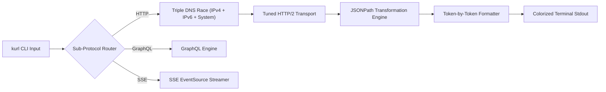

<div align="center">

# ⚡ kurl

### A modern, concurrent HTTP/GraphQL/SSE/gRPC client for the terminal — built in Go.

[](https://goreportcard.com/report/github.com/kavix/kurl)
[](https://github.com/kavix/kurl/actions)
[](LICENSE)
[](https://github.com/kavix/homebrew-tap)
[](https://go.dev)

<p align="center">
  
</p>

*Zero-config scheme probing, concurrent triple-DNS racing, token-by-token syntax highlighting, built-in JSONPath filtering, native GraphQL, Server-Sent Events (SSE), request replays, and environment profiles. All packed into a single static binary with zero dependencies.*

[Quick Start](#-quick-start) • [Installation](#-installation) • [Feature Showcase](#-feature-showcase) • [Architecture](#-architecture) • [Documentation](#-documentation)

</div>

---

## 🚀 Why kurl?

CLI HTTP clients have traditionally fallen into two extremes: **`curl`** (blazing fast & universal, but unformatted raw output with a steep CLI learning curve) and **`HTTPie`** (beautiful output, but heavy Python runtime dependency). 

**`kurl`** bridges this gap: giving you **`curl`'s static binary speed** paired with **`HTTPie`'s visual elegance**, while introducing modern features like **Triple-DNS racing**, **built-in JSONPath filtering**, **native GraphQL support**, **Server-Sent Events (SSE)**, and **environment profiles**.

### 📊 Feature Comparison Matrix

| Feature | `curl` | `HTTPie` | `kurl` |
| :--- | :---: | :---: | :---: |
| **Single Static Binary** | ✅ | ❌ *(Python Runtime)* | ✅ |
| **Zero-Config Scheme Probing (`http` / `https`)** | ❌ | ❌ | ✅ *(Parallel Probing)* |
| **Concurrent DNS Racing** | ❌ | ❌ | ✅ *(1.1.1.1 + IPv6 + System)* |
| **Token-by-Token JSON Formatter** | ❌ | ✅ | ✅ *(Zero-Alloc Cache)* |
| **Built-in JSONPath Filtering (`--filter`)** | ❌ *(Needs `jq`)* | ❌ *(Needs `jq`)* | ✅ *(Native Engine)* |
| **Native GraphQL Client (`kurl graphql`)** | ❌ | ❌ | ✅ *(Query/Variables/Introspect)* |
| **Native gRPC Client (`kurl grpc://`)** | ❌ | ❌ | ✅ *(Reflection, Protobuf, mTLS)* |
| **Server-Sent Events (SSE) Streamer (`kurl sse`)** | ❌ | ❌ | ✅ *(W3C EventSource)* |
| **Smart HTML5 DOM Pretty-Printer** | ❌ | ❌ | ✅ *(Inline Tag Collapsing)* |
| **Anti-Bot Header Auto-Injection** | ❌ | ❌ | ✅ *(Cloudflare/WAF Bypass)* |
| **Request Save & Replay System** | ❌ | ❌ | ✅ *(Postman-like CLI Replays)* |
| **Environment Profiles (`dev` / `staging` / `prod`)** | ❌ | ❌ | ✅ |
| **Interactive WebSocket Client** | ❌ | ❌ | ✅ *(Duplex Terminal Socket)* |

---

## 📦 Installation

### macOS / Linux (Homebrew)

```bash
brew tap kavix/tap
brew install kurl
```

### Direct Download (Pre-compiled Binaries)

Download the latest pre-compiled static binary for your OS and Architecture from the [Releases](https://github.com/kavix/kurl/releases) page:

```bash
# macOS (Apple Silicon / M1 / M2 / M3)
curl -sSL https://github.com/kavix/kurl/releases/latest/download/kurl_darwin_arm64.tar.gz | tar -xz && sudo mv kurl /usr/local/bin/

# Linux (x86_64)
curl -sSL https://github.com/kavix/kurl/releases/latest/download/kurl_linux_amd64.tar.gz | tar -xz && sudo mv kurl /usr/local/bin/
```

### From Source (Go 1.22+)

```bash
git clone https://github.com/kavix/kurl.git
cd kurl
make install
```

---

## ⚡ Quick Start

```bash
# 1. Zero-config scheme probing & DNS racing (auto-resolves https://)
kurl api.github.com/users/kavix

# 2. Native JSONPath filtering without piping to jq!
kurl https://api.github.com/users/kavix --filter .company

# 3. CSV Key projection & object filtering
kurl https://api.github.com/users/kavix --filter-keys "login, name, location, public_repos"

# 4. Native GraphQL queries with variables
kurl graphql https://countries.trevorblades.com/ --query '{ country(code: "LK") { name capital currency emoji } }'

# 5. Live Server-Sent Events (SSE) streaming with event filtering
kurl sse https://api.example.com/events --sse-filter message

# 6. Save a request profile and replay it with overrides
kurl save github-user GET https://api.github.com/users/kavix -H "Accept: application/json"
kurl run github-user -v

# 7. Environment profiles (dev / staging / prod)
kurl --env prod /users/search

# 8. Invoke a gRPC service using server reflection
kurl grpc://api.example.com:443 mypackage.MyService/MyMethod
```

---

## ✨ Feature Showcase

### 1. 🔍 Built-in JSONPath Filtering (`--filter`, `--filter-keys`, `--filter-flatten`)
No need to pipe CLI responses into `jq`. Extract nested fields directly while preserving syntax highlighting:
```bash
# Extract single or nested fields
kurl https://api.github.com/users/kavix --filter .name

# Project specific keys from objects or arrays
kurl https://api.github.com/users/kavix --filter-keys "name, bio, public_repos"

# Flatten multi-dimensional array payloads
kurl https://api.example.com/matrix --filter-flatten
```

### 2. 🔷 Native GraphQL Engine (`kurl graphql`)
Crafting JSON payloads and escaping GraphQL string quotes manually is tedious. `kurl` provides a dedicated GraphQL sub-engine:
```bash
# Execute GraphQL query
kurl graphql https://api.example.com/graphql --query '{ user(id: 1) { name email } }'

# Execute with JSON variables
kurl graphql https://api.example.com/graphql --query 'query GetUser($id: ID!) { user(id: $id) { name } }' --variables '{"id": "123"}'

# Execute schema introspection
kurl graphql https://api.example.com/graphql --introspect

# Auto-generate GraphQL query template for a type
kurl graphql https://api.example.com/graphql --generate-query User
```

### 3. 📡 Server-Sent Events (SSE) Streamer (`kurl sse`)

Individual stream lines must be smaller than 1 MiB (including the line ending). Larger lines return an error instead of growing the scanner without a bound.
Stream live event feeds (logs, AI completions, notifications) with real-time timestamps and event-type colorization:
```bash
# Stream all SSE events
kurl sse https://api.example.com/stream

# Stream and filter specific event types
kurl sse https://api.example.com/stream --sse-filter update

# Stream and record events to a log file
kurl sse https://api.example.com/stream --sse-output sse_events.log
```

### 4. 🔗 Native gRPC Client (`kurl grpc://`)
Test and debug gRPC microservices effortlessly without switching to a different tool:
```bash
# List available services via reflection
kurl grpc://api.example.com:443 --list-services

# Invoke a method with a JSON payload
kurl -d '{"id": "123"}' grpc://api.example.com:443 mypackage.MyService/MyMethod

# Use local .proto files instead of server reflection
kurl --proto ./service.proto grpc://api.example.com:443 mypackage.MyService/MyMethod

# Connect with mTLS certificates
kurl --cert client.crt --key client.key grpc://api.example.com:443 mypackage.MyService/MyMethod
```

### 5. ⚡ Triple-DNS Racing Resolver
Standard DNS resolvers can hang on VPNs or slow ISP servers. `kurl` simultaneously queries:
1. **Cloudflare Public IPv4** (`1.1.1.1:53`)
2. **Cloudflare Public IPv6** (`[2606:4700:4700::1111]:53`)
3. **Local System Resolver** (`DefaultResolver`)

The fastest response immediately wins and dials the socket, while loser contexts are cancelled.

---

## 🛠️ Configuration & Environment Profiles

Create environment definitions in `~/.kurl/environments.json`:

```json
{
  "dev": {
    "base_url": "http://localhost:8080/v1",
    "headers": [
      "X-Environment: development",
      "Authorization: Bearer dev-secret-token"
    ]
  },
  "prod": {
    "base_url": "https://api.production.com/v1",
    "headers": [
      "X-Environment: production",
      "Authorization: Bearer prod-secret-token"
    ]
  }
}
```

Switch base URLs and auth headers dynamically:
```bash
kurl --env dev /users/123
kurl --env prod /users/123
```

---

## 📐 Architecture & Performance

For deep-dive documentation on `kurl`'s multi-threaded network model, zero-allocation token formatter, and state machine designs, see the **[Architecture & Technical Design Guide](docs/ARCHITECTURE.md)**.



---

## 🤝 Contributing

Contributions are welcome! Please feel free to open an issue or submit a pull request.

1. Fork the Project
2. Create your Feature Branch (`git checkout -b feature/AmazingFeature`)
3. Commit your Changes (`git commit -m 'feat: add AmazingFeature'`)
4. Push to the Branch (`git push origin feature/AmazingFeature`)
5. Open a Pull Request

Read our **[Contributing Guidelines](CONTRIBUTING.md)** for developer setup and testing workflows.

---

## 📄 License

Distributed under the MIT License. See [`LICENSE`](LICENSE) for details.
